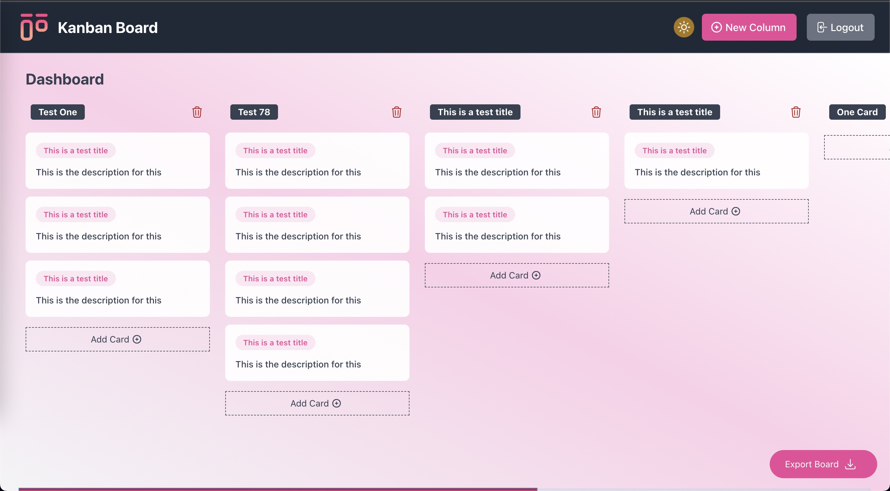

<div align="center">
    <h1 align="center">KANBAN BOARD</h1>
    <a href="https://muarachmann.com" target="_blank">
        
    </a>
</div>

<p align="center">
    
</p>

## Introduction
Kanban is a platform that allows us to create a typical kanban board. You can add cards to a column.
Consider this your traditional todo list board.

## Table of Contents

1. [Requirements](#requirements)
2. [Features](#features)
3. [Installation](#installation)
4. [Usage](#usage)
5. [Change log](#change-log)
6. [Testing](#testing)
7. [Contributing](#contributing)
8. [References](#references)
9. [Security](#security)
10. [Credits](#credits)
11. [License](#license)


## Requirements
Make sure your server meets the following requirements.

-   Apache 2.2+ or nginx
-   MySQL Server 5.7.8+ , Mariadb 10.3.2+ or PostgreSQL
-   Composer installed
-   PHP Version 8.0+
-   Node v16.17.0 / NPM 8.15.0

### PHP extensions

Make sure you have the following php extensions enabled

bz2, curl, date, dom, exif, gettext, intl, json, libxml, mbstring, fileinfo, mysqli, openss, PDO,
pdo_mysql, posix, soap, sqlite3, xml, xmlreader, xmlwriter
xsl, zip, zlib


### Tech Stack

This application is built using (php, Laravel 9, Vue2, tailwindcss)
Please  be sure to google about this stack in order to better understand.
Also, as side note, we use other tools for smooth integration such as

`spatie-db-dumper, vue-js-modal, vue-draggable`. The links are available in the [References](#references) section
below


## Features
It packs in lots of demanding features that allows this project to scale in no time:

- [x] Auth & Main Pages
- [x] Kanban Board
- [x] Add and Delete columns
- [x] Delete Columns
- [x] Access cards via access token
- [ ] Preserve Board state (remember where board was lastly saved)
- [ ] Add card to column when dragged

## Installation

Install composer with the help of the instructions given [here](https://getcomposer.org/doc/00-intro.md#installation-linux-unix-macos)
```bash  
wget https://getcomposer.org/composer.phar
chmod +x composer.phar
mv composer.phar /usr/local/bin/composer  
``` 

Install Node.js/NPM with the help of the instructions given [here](https://nodejs.org/en/download/package-manager/)
However it is good to use node version manager (nvm) in order to manage and choose the correct node version.


Linux/Unix `yum install npm` OR using MacOs `brew install node`

Fork and/or clone this project by running the following command
```bash  
git clone https://github.com/muarachmann/kanban-board.git
```

Navigate into the project's directory
```bash  
cd kanban-board
```

Copy .env.example for .env and modify according to your credentials
```bash
cp .env.example .env
```

Run this command to install dependencies
```bash
composer install --prefer-dist
```
This command will install all dependencies needed by the Waspito Lab platform to run successfully!

Generate application key
```bash
php artisan key:generate
```

Install npm/yarn dependencies  (Preference is using *Yarn*)
```bash
npm install or yarn install 
```

## Database Setup

Create a database first, then migrate and seed the kanban board. database, which has vital information about the functioning of the app.
```bash
php artisan migrate:fresh --seed 
```
*Note:* This is always clear any information and reseed, use it wisely a better option when modifications are done is to
migrate and reseed.

### Running Custom Commands
The kanban board comes with several commands which are run to ensure proper functioning of the system
for example to generate access tokens to have access to all cards.

A few are cited below, feel free to add more by contributing to this readme.
<table>
    <tr>
        <td style="font-weight: bolder">Command</td>
        <td style="font-weight: bolder">Description</td>
    </tr>
    <tr>
        <td><code>php artisan serve</code></td>
         <td>
            Runs the application on a local port (8000) by default.
         </td>
    </tr>
    <tr>
        <td><code>php artisan k-board:token</code></td>
         <td>
            Returns a valid access token that can be used to access all cards. See [#Access-cards]
         </td>
    </tr>
</table>

### API Access token

If you ish to access all cards in the board. You can do that via an api token.
First you will need to create one uisin ghte `k-board:token` command to get a valid token. 
**NB** This token is valid for 2 hours. Once done? use it as shown below:

`GET https://kanban-board.test/api/k-board/cards?access_token=<access_token>&date=2023-01-08&status=1`

**Filters** 
`{'status': '0|1', 'date': 'YYYY-MM-DD}` <br>

Where `status = 0` returns all deleted cards and `status = 1` all active cards

## Usage

NB: It is advisable to install [valet](https://laravel.com/docs/valet) in order to better test functionality
If you are on a Linux based OS. Make sure to install its own version [valet-linux](https://cpriego.github.io/valet-linux/)
**notice** While I haven't tried on a windows machine feel free to explore - https://medium.com/@samimrezgui123/how-to-install-laravel-valet-on-windows-os-afdc23d69719

Once valet is setup, navigate to http://kanban-board.test

Run yarn/npm in dev mode
`npm run dev` OR `yarn run dev`

## Change log

Please see the [changelog](changelog.md) for more information on what has changed recently.

## Testing

// todo

Run the tests using:
```bash  
composer test  
```
## Contributing

Please see [contributing.md](contributing.md) for details and a todolist.

## References

Please see [contributing.md](contributing.md) for details and a todolist.

## Security

If you discover any security related issues, please email muarachmann@gmail.com instead of using the issue tracker.

## Credits

- [Mua Rachmann](https://github.com/muarachmann)

## License

MIT. Please see the [license file](license.md) for more information.
